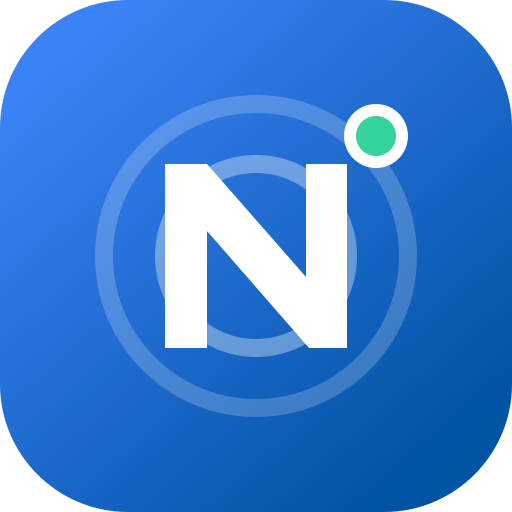

<div align="center">
  
  <h1>Neloa</h1>
  <p><strong>无需账号，在你的设备之间安全传输文件与剪贴板。</strong></p>
  <p>Local-first encrypted file and clipboard transfer—without an account.</p>
  <p>
    <a href="https://github.com/kure29/Neloa/actions/workflows/ci.yml"></a>
    <a href="https://github.com/kure29/Neloa/releases/latest"></a>
    <a href="LICENSE"></a>
    
  </p>
  <p><a href="#简体中文">简体中文</a> · <a href="#english">English</a></p>
</div>

> [!IMPORTANT]
> Neloa 仍在积极开发中。macOS 和 Windows 安装包没有商业代码签名，iOS IPA 需要使用自己的 Apple 证书重签后安装。

## 简体中文

Neloa 优先使用局域网直连；设备不在同一网络时，也可以通过你自己的中继服务器建立连接。文件和剪贴板内容始终由客户端端到端加密，中继只转发无法解读的加密数据。

当前开发版本：**0.1.11**

### 功能

- 自动发现同一局域网内的 macOS、Windows、Android 和 iOS 设备
- 首次配对时在两端核对六位验证码，之后固定设备身份密钥
- 支持多文件选择、发送队列、取消、失败重试和 SHA-256 完整性校验
- macOS 与 Windows 支持把多个文件直接拖入软件窗口
- 剪贴板同步默认关闭，限制为纯文本，并拦截常见密钥内容
- 所有客户端均可自定义设备名称
- 可选自建 WebSocket 中继，局域网连接失败时自动回退
- 深色模式、移动端布局和系统安全凭据存储

### 下载与安装

正式构建位于 [GitHub Releases](https://github.com/kure29/Neloa/releases)。请按设备选择对应文件：

| 平台 | 构建 | 安装说明 |
| --- | --- | --- |
| macOS | Universal DMG | 兼容 Apple Silicon 与 Intel；当前为 ad-hoc 签名，系统可能要求手动确认打开 |
| Windows | x64 NSIS | 当前没有商业签名，SmartScreen 可能显示“未知发布者” |
| Android | ARM64 / x86_64 APK | ARM64 用于大多数真机，x86_64 用于部分模拟器；APK 使用项目固定密钥签名 |
| iOS | 未签名 IPA | 需要使用自己的 P12 证书与描述文件重签，不能直接安装 |

### 使用方法

1. 在两台设备上打开 Neloa；局域网使用时让它们连接同一网络。
2. 在雷达页选择设备，核对两端显示的六位数字并确认配对。
3. 选择一个或多个文件；桌面端也可以把文件拖进窗口。
4. 检查发送列表并点击发送，接收端需要明确接受每个文件。
5. 跨网络使用前，先在局域网完成一次配对，再在两端配置同一个自建中继。

接收文件先写入临时文件，校验成功后才会发布到系统下载目录的 `Neloa` 文件夹，并且不会覆盖同名文件。

### 安全设计

- QUIC 负责传输，Noise XX 负责身份认证和应用层端到端加密。
- 长期设备私钥保存在 Keychain、Windows Credential Manager 或移动系统安全存储中。
- 第一次配对必须由两端核对验证码并分别确认。
- 文件发送前计算 SHA-256，接收端完整校验后再原子发布。
- 剪贴板正文不会写入诊断报告或持久化记录。
- 中继能看到在线设备元数据、流量时间和大小，但不能读取 Noise 加密后的内容。

完整边界与威胁模型请阅读 [ARCHITECTURE.md](ARCHITECTURE.md)。

### 自建中继

中继位于 `relay/`，适合单用户部署，不需要数据库：

```bash
cp relay/.env.example relay/.env
# 将 relay/.env 中的令牌替换为：openssl rand -hex 32
docker compose --env-file relay/.env -f relay/compose.yaml up -d --build
```

服务默认只监听 `127.0.0.1:8787`。请使用 Caddy、Nginx 或 1Panel 反向代理并提供 HTTPS，客户端填写 `wss://你的域名/v1/ws`。不要把明文 WebSocket 端口直接暴露到公网。

详细部署与配置见 [relay/README.md](relay/README.md)。

### 本地开发

需要 Node.js 20+、npm、Rust stable，以及对应平台的 [Tauri 2 环境依赖](https://v2.tauri.app/start/prerequisites/)。

```bash
npm install
npm run tauri dev
```

常用命令：

| 命令 | 用途 |
| --- | --- |
| `npm run dev` | 仅预览前端界面，不包含原生网络和文件能力 |
| `npm run tauri dev` | 运行桌面客户端 |
| `npm run tauri -- build` | 生成当前桌面平台安装包 |
| `npm run android:build` | 构建 Android 客户端 |
| `npm run ios:build` | 构建 iOS 客户端 |

移动端生成工程包含自定义原生桥接代码，不要随意重新运行 `tauri android init` 或 `tauri ios init`。详细步骤见 [MOBILE_BUILD.md](MOBILE_BUILD.md) 和 [WINDOWS_BUILD.md](WINDOWS_BUILD.md)。

### 项目结构

```text
src/                         React 界面与 Tauri 调用桥
src-tauri/                   客户端 Rust 核心及原生工程
relay/                       自建中继服务与 Docker Compose
crates/neloa-relay-protocol/ 客户端和中继共享协议
.github/workflows/           持续集成与安装包构建
```

## English

Neloa transfers files and plain-text clipboard updates between your own devices. It prefers direct LAN QUIC connections and can fall back to a self-hosted WebSocket relay for devices that were already paired locally. Application data remains protected by Noise XX end-to-end encryption on either route.

### Highlights

- macOS, Windows, Android, and iOS clients built with Tauri 2
- Six-digit verification before a device identity is trusted
- Multi-file selection, desktop drag and drop, cancellation, retry, and SHA-256 verification
- Opt-in clipboard sync with size limits and sensitive-content safeguards
- Custom device names and native secure credential storage
- Optional single-user relay with LAN-first automatic fallback

Download stable packages from [GitHub Releases](https://github.com/kure29/Neloa/releases). Desktop packages are not commercially signed, and the iOS IPA must be re-signed with your own Apple certificate and provisioning profile.

To develop locally:

```bash
npm install
npm run tauri dev
```

See [architecture and security](ARCHITECTURE.md), [mobile builds](MOBILE_BUILD.md), [Windows builds](WINDOWS_BUILD.md), and [relay deployment](relay/README.md) for details.

## License

Neloa is available under the [MIT License](LICENSE).
