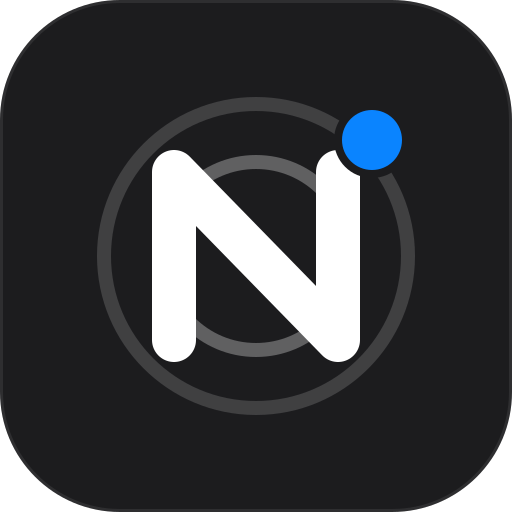

<div align="center">
  
  <h1>Neloa</h1>
  <p><strong>无需账号，在你的设备之间安全传输文件与剪贴板。</strong></p>
  <p>Local-first encrypted file and clipboard transfer—without an account.</p>
  <p>
    <a href="https://github.com/kure29/Neloa/actions/workflows/ci.yml"></a>
    <a href="https://github.com/kure29/Neloa/releases/latest"></a>
    <a href="LICENSE"></a>
    
  </p>
  <p><a href="https://github.com/kure29/Neloa/releases/latest"><strong>下载最新版</strong></a> · <a href="https://kure29.github.io/Neloa/"><strong>在线文档</strong></a> · <a href="#english">English</a></p>
</div>

> [!IMPORTANT]
> 当前版本 **0.1.13**。macOS 与 Windows 安装包没有商业代码签名；iOS IPA 未签名，需要用自己的 Apple 证书和描述文件重签后安装。

## 简体中文

Neloa 是一个面向个人多设备的本地优先传输工具。它不需要账号，不上传文件到云盘：同一网络内通过 QUIC 直连，离开局域网后可选用你自己部署的 WebSocket 中继。文件与剪贴板文本在两条路径上都由 Noise XX 端到端加密。

### 适合什么场景

- Mac、Windows、Android 与 iPhone 之间互传一个或一批文件。
- 在自己的设备间同步纯文本剪贴板，同时拦截超长文本和常见私钥内容。
- 不想注册账号，也不想把文件交给第三方网盘。
- 愿意自建一个轻量中继，让自己的设备跨网络发现、配对和传输。

### 连接方式

- 每台设备都必须明确选择连接方式，选择会按设备保存。0.1.13 稳定版提供「局域网」和「中继」。
- Neloa 不会推荐、自动判断或在失败后静默切换路径；需要换路时由你手动选择。
- 首次配对也可以通过中继完成，但仍必须在两端核对六位验证码并分别确认。
- 当前源码还为附近的 Android 设备提供「点对点 Wi-Fi」；它不要求两端接入同一个局域网，仍复用 QUIC 与 Noise XX。该能力尚未包含在 0.1.13 Release 中。
- 当前源码还为附近的 macOS/iOS 设备提供「蓝牙」发现与传输。它使用带顺序检查和背压的 BLE GATT 字节流，应用数据仍由 Noise XX 端到端加密；该能力同样尚未包含在 0.1.13 Release 中。

### 下载与安装

从 [GitHub Releases 最新版本](https://github.com/kure29/Neloa/releases/latest) 下载。Release 页面同时提供每个文件的 SHA-256：

| 平台 | 下载文件 | 说明 |
| --- | --- | --- |
| macOS | `Neloa_0.1.13_universal.dmg` | Apple Silicon / Intel 通用包，ad-hoc 签名 |
| Windows | `Neloa_0.1.13_x64-setup.exe` | Windows x64 NSIS，未商业签名 |
| Android 真机 | `Neloa_0.1.13_arm64.apk` | 使用项目固定密钥签名 |
| iOS | `Neloa_0.1.13_unsigned.ipa` | 未签名，必须自行重签 |

> macOS/iOS 首次启动请允许“本地网络”权限。当前源码还会请求蓝牙权限，用于发现附近的 Apple 设备并建立用户明确选择的 BLE 连接。

### 30 秒开始传输

1. 在两台设备上安装并打开 Neloa；局域网直连时连接同一网络，跨网络时配置同一个自建中继。
2. 选择对方设备，核对两端六位数字并分别确认配对。
3. 选择文件；macOS 和 Windows 也支持直接拖入多个文件。
4. 接收端确认后开始传输，完成时校验文件大小与 SHA-256。

跨网络发现、配对与传输需要在两端配置同一个[自建中继](https://kure29.github.io/Neloa/guide/relay)。

### 文档

完整的安装、配对、传输、中继部署与排错步骤见[中文文档](https://kure29.github.io/Neloa/)；[English documentation](https://kure29.github.io/Neloa/en/)。仓库内的主要资料：

| 主题 | 位置 |
| --- | --- |
| 使用文档 | [docs/guide/](docs/guide/index.md) |
| 架构与威胁模型 | [docs/reference/architecture.md](docs/reference/architecture.md) |
| Rust / Docker 中继部署与线协议 | [relay/README.md](relay/README.md) |
| Cloudflare Workers 中继 | [relay-worker/README.md](relay-worker/README.md) |
| 移动端构建与真机验收 | [docs/build/mobile.md](docs/build/mobile.md) |
| Windows 安装程序 | [docs/build/windows.md](docs/build/windows.md) |

### 本地开发

需要 Node.js 20+、npm、Rust stable，以及对应平台的 [Tauri 2 环境依赖](https://v2.tauri.app/start/prerequisites/)。

```bash
npm install
npm run tauri dev     # 桌面客户端
npm run docs:dev      # 本地预览文档
```

移动端生成工程包含 Android 多播锁、iOS Bonjour 适配层等自定义代码，不要随意重新运行 `tauri android init` 或 `tauri ios init`。

## English

Neloa is a local-first file and plain-text clipboard transfer app for your own devices. It needs no account and uploads no files to a cloud drive. You explicitly select the route for each peer. Noise XX protects pairing and application data end to end on every route.

Neloa never recommends, automatically selects, or silently changes the route. Initial pairing can use the relay; both devices must still compare and confirm the same six-digit code. The current source tree also supports explicit Android-to-Android Wi-Fi Direct and BLE discovery/transport between macOS and iOS devices. Both reuse the same authenticated Noise XX application protocol and are not included in the 0.1.13 release artifacts.

Download macOS, Windows, Android, and unsigned iOS packages from the [latest GitHub Release](https://github.com/kure29/Neloa/releases/latest). Desktop packages are not commercially signed, and the iOS IPA must be re-signed with your own Apple certificate and provisioning profile. The full [English documentation](https://kure29.github.io/Neloa/en/) covers installation, pairing, transfers, relay deployment, and troubleshooting.

For development, install Node.js 20+, npm, Rust stable, and the platform-specific Tauri 2 prerequisites:

```bash
npm install
npm run tauri dev
```

See the [architecture and threat model](docs/en/reference/architecture.md) and [relay deployment guide](relay/README.md) for implementation details.

## License

Neloa is available under the [Apache License 2.0](LICENSE).
